# 🏗️ Arquitectura del Sistema Estacional - Los Cocos

## 📊 Diagrama de Flujo Principal

```mermaid
graph TD
    A[Usuario accede al sitio] --> B[DOM cargado]
    B --> C[Detectar fecha actual]
    C --> D[Determinar temporada]
    D --> E[changeSeason(season)]
    E --> F[Cargar configuración]
    F --> G[Actualizar elementos]
    
    G --> H[updateSeasonIndicator]
    G --> I[updateBackground]
    G --> J[updateHeroContent]
    G --> K[updateTimelineCards]
    G --> L[updateSpeciesSection]
    G --> M[updatePreparationSection]
    G --> N[updateCalendar]
    G --> O[updateSeasonInfoPanel]
    G --> P[updateActionButtons]
    
    Q[Usuario hace clic en temporada] --> E
```

## 🔄 Flujo de Datos Estacionales

```mermaid
sequenceDiagram
    participant U as Usuario
    participant DOM as DOM
    participant JS as autumn-features.js
    participant CONFIG as seasons{}
    
    U->>DOM: Carga página
    DOM->>JS: DOMContentLoaded
    JS->>JS: Detectar temporada actual
    JS->>CONFIG: Obtener configuración
    CONFIG-->>JS: Datos de temporada
    JS->>DOM: Actualizar elementos
    DOM-->>U: Mostrar contenido
    
    U->>DOM: Click botón temporada
    DOM->>JS: changeSeason(season)
    JS->>CONFIG: Obtener nueva configuración
    CONFIG-->>JS: Nuevos datos
    JS->>DOM: Actualizar todos los elementos
    DOM-->>U: Mostrar nuevo contenido
```



## 🗂️ Estructura de Datos

### Objeto Principal `seasons`
```javascript
seasons = {
  [temporada]: {
    // Metadatos básicos
    name: string,
    icon: emoji,
    period: string,
    background: url,
    overlay: css_class,
    gradient: css_class,
    colors: { primary, secondary },
    
    // Datos específicos de sección
    speciesData: {
      bannerText: string,
      title: string,
      description: string,
      bannerGradient: css_class,
      titleGradient: css_class
    },
    
    // Datos de preparación
    preparationData: {
      sectionGradient: css_class,
      bannerText: string,
      title: string,
      description: string,
      steps: [
        {
          number: int,
          icon: emoji,
          title: string,
          description: string,
          tips: string
        }
      ],
      kit: {
        title: string,
        products: [
          { name, price }
        ],
        individualPrice: int,
        finalPrice: int,
        savings: int
      }
    },
    
    // Otros datos
    featuredPlants: [{ icon, title, desc }],
    offers: { title, subtitle, products, prices },
    tips: [{ title, desc }]
  }
}
```

## 🔧 Funciones Core del Sistema

### 1. Función Master: `changeSeason(season)`
```javascript
function changeSeason(season) {
  // 1. Validar temporada
  if (!seasons[season]) return;
  
  // 2. Actualizar variable global
  currentSeason = season;
  
  // 3. Obtener configuración
  const config = seasons[season];
  
  // 4. Ejecutar actualizaciones en orden
  updateSeasonIndicator(config);
  updateBackground(config);
  updateHeroContent(config);
  updateTimelineCards(season);
  updateSpeciesSection(config);
  updatePreparationSection(config);
  updatePreparationKit(config);
  updateCalendar(config);
  updateSeasonInfoPanel(config);
  updateActionButtons(config);
  
  // 5. Log de confirmación
  console.log('✅ Temporada cambiada:', season);
}
```

### 2. Patrón de Actualización de Elementos
```javascript
function updateElemento(config) {
  try {
    // 1. Obtener elemento del DOM
    const elemento = document.getElementById('elemento-id');
    
    // 2. Verificar existencia
    if (!elemento) {
      console.warn('Elemento no encontrado');
      return;
    }
    
    // 3. Aplicar cambios
    elemento.textContent = config.data;
    elemento.className = `base-class ${config.dynamicClass}`;
    
    // 4. Log de éxito
    console.log('✅ Elemento actualizado');
    
  } catch (error) {
    console.error('❌ Error:', error);
  }
}
```

## 🎨 Sistema de Estilos Dinámicos

### Gradientes por Temporada
```css
/* Primavera */
.from-green-500.to-emerald-600

/* Verano */
.from-yellow-500.to-orange-600

/* Otoño */
.from-orange-500.to-red-500

/* Invierno */
.from-blue-500.to-indigo-600
```

### Clases CSS Dinámicas
```javascript
// Función para obtener clases por temporada
function getSeasonClass(season, type) {
  const classes = {
    primavera: {
      gradient: 'from-green-500 to-emerald-600',
      text: 'text-green-600',
      bg: 'bg-green-50'
    },
    verano: {
      gradient: 'from-yellow-500 to-orange-600',
      text: 'text-orange-600',
      bg: 'bg-yellow-50'
    },
    // ...
  };
  
  return classes[season][type];
}
```

## 📱 Responsividad y Adaptabilidad

### Breakpoints Tailwind
```css
/* Móvil: base */
.text-sm

/* Tablet: md */
@media (min-width: 768px) {
  .md:text-base
}

/* Desktop: lg */
@media (min-width: 1024px) {
  .lg:text-lg
}
```

### Grid Responsivo
```html
<!-- Timeline estacional -->
<div class="grid grid-cols-2 lg:grid-cols-4 gap-4 lg:gap-6">
  <!-- Cards de temporadas -->
</div>

<!-- Contenido principal -->
<div class="grid grid-cols-1 md:grid-cols-2 lg:grid-cols-3 gap-6 sm:gap-8">
  <!-- Productos -->
</div>
```

## 🔄 Detección Automática de Temporada

```javascript
// Lógica de detección
function detectCurrentSeason() {
  const currentMonth = new Date().getMonth() + 1;
  
  if (currentMonth >= 9 && currentMonth <= 11) return 'primavera';
  if (currentMonth >= 12 || currentMonth <= 2) return 'verano';
  if (currentMonth >= 3 && currentMonth <= 5) return 'otono';
  if (currentMonth >= 6 && currentMonth <= 8) return 'invierno';
  
  return 'otono'; // Fallback
}

// Aplicación en DOMContentLoaded
document.addEventListener('DOMContentLoaded', function() {
  const detectedSeason = detectCurrentSeason();
  changeSeason(detectedSeason);
});
```

## 🎯 Elementos del DOM con IDs Dinámicos

### Mapeo ID → Función
```javascript
const elementMapping = {
  // Indicadores de temporada
  'season-indicator': 'updateSeasonIndicator',
  'season-icon-left': 'updateSeasonIndicator',
  'current-season': 'updateSeasonIndicator',
  
  // Contenido hero
  'hero-title': 'updateHeroContent',
  'hero-subtitle': 'updateHeroContent',
  'hero-description': 'updateHeroContent',
  
  // Panel de información
  'season-info-badge': 'updateSeasonInfoPanel',
  'season-info-icon': 'updateSeasonInfoPanel',
  'season-info-text': 'updateSeasonInfoPanel',
  'season-tips-grid': 'updateSeasonInfoPanel',
  
  // Calendario
  'calendar-title': 'updateCalendar',
  'calendar-months': 'updateCalendar',
  
  // Botones de acción
  'action-button-1': 'updateActionButtons',
  
  // Sección preparación
  'preparation-section': 'updatePreparationSection',
  'preparation-title': 'updatePreparationSection',
  'kit-products': 'updatePreparationKit',
  'kit-title': 'updatePreparationKit'
};
```

## 🛠️ Herramientas de Debug

### Console Logs Estructurados
```javascript
// Inicio de función
console.log('🔄 Actualizando [elemento]...');

// Éxito
console.log('✅ [Elemento] actualizado correctamente');

// Error
console.error('❌ Error actualizando [elemento]:', error);

// Información
console.log('🎯 Temporada detectada:', season);
```

### Verificaciones de Elementos
```javascript
function debugElement(elementId) {
  const element = document.getElementById(elementId);
  console.log(`Debug ${elementId}:`, {
    exists: !!element,
    content: element?.textContent,
    classes: element?.className,
    visible: element?.offsetParent !== null
  });
}
```

## 🔮 Extensibilidad del Sistema

### Agregar Nueva Temporada
1. **Extender objeto `seasons`:**
```javascript
seasons.nuevaTemporada = {
  name: 'Nueva Temporada',
  // ... resto de propiedades
};
```

2. **Actualizar detección automática:**
```javascript
function detectCurrentSeason() {
  // Agregar lógica para nueva temporada
  if (condicion) return 'nuevaTemporada';
}
```

3. **Agregar botón de testing:**
```html
<button onclick="changeSeason('nuevaTemporada')">
  🆕 Nueva Temporada
</button>
```

### Agregar Nuevo Elemento Dinámico
1. **HTML con ID único:**
```html
<div id="nuevo-elemento">Contenido inicial</div>
```

2. **Función de actualización:**
```javascript
function updateNuevoElemento(config) {
  const elemento = document.getElementById('nuevo-elemento');
  if (elemento) {
    elemento.textContent = config.nuevoContenido;
  }
}
```

3. **Integrar en `changeSeason()`:**
```javascript
function changeSeason(season) {
  // ... código existente ...
  updateNuevoElemento(config);
}
```

## 📊 Performance y Optimización

### Lazy Loading de Imágenes
```javascript
// Implementar cuando sea necesario
function lazyLoadImages() {
  const images = document.querySelectorAll('img[data-src]');
  const imageObserver = new IntersectionObserver((entries) => {
    entries.forEach(entry => {
      if (entry.isIntersecting) {
        const img = entry.target;
        img.src = img.dataset.src;
        imageObserver.unobserve(img);
      }
    });
  });
  
  images.forEach(img => imageObserver.observe(img));
}
```

### Debounce para Eventos
```javascript
function debounce(func, wait) {
  let timeout;
  return function executedFunction(...args) {
    const later = () => {
      clearTimeout(timeout);
      func(...args);
    };
    clearTimeout(timeout);
    timeout = setTimeout(later, wait);
  };
}

// Uso para resize events
window.addEventListener('resize', debounce(() => {
  // Reajustar elementos si es necesario
}, 250));
```

---

## 🏷️ Notas Técnicas

- **Compatibilidad:** ES6+ (Chrome 60+, Firefox 55+, Safari 12+)
- **Dependencias:** Ninguna (Vanilla JS)
- **Tamaño:** ~1,200 líneas de JavaScript
- **Performance:** Todas las actualizaciones son síncronas y rápidas
- **Escalabilidad:** Fácil agregar nuevas temporadas o elementos

---

*Esta arquitectura está diseñada para ser mantenible, extensible y fácil de entender.* 